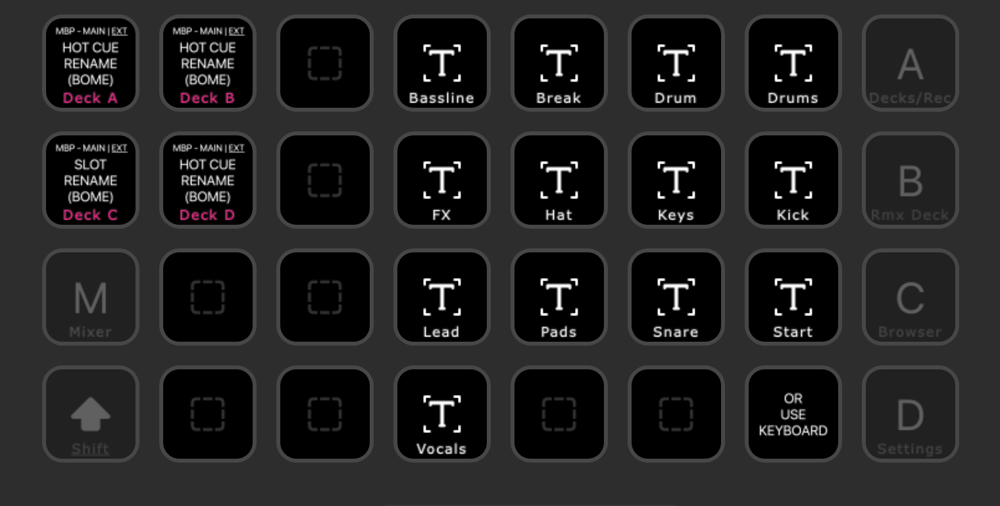

# Control Traktor

A collection of settings and Max4Live devices for improved control over Traktor Pro.

## Installation only

1. See [INSTALL](https://github.com/dotherightthing/control-traktor/blob/main/INSTALL.md)

## Installation and development

1. [Install Node and NPM](https://docs.npmjs.com/downloading-and-installing-node-js-and-npm) and [Git](https://git-scm.com/book/en/v2/Getting-Started-Installing-Git)
2. `git clone` this repo
3. Run `npm install` to install dependencies, run the build which outputs to `dist`
4. Run `npm run backup` to overwrite local files with deployed files
5. Run `npm run reinstall` to recreate `dist` folder
6. Run `npm run watch` to build as you save file changes

## Release

1. Update the `version` in package.json
2. Tag the latest commit with the message `Bump version`
3. Push to Github and an action will run to generate a new *Release*
4. Open [the Releases page](https://github.com/dotherightthing/control-traktor/releases) > select the release > Edit > Select Previous tag > Generate release notes

## Screenshots




---

## Control Traktor v6 ("CT6") update (2026.01.27)

### Description

* Streamdeck XL (`CT6.streamDeckProfile`):
  * install script now outputs files and shortcuts into *~/Documents/control-traktor/*

## Control Traktor v6 ("CT6") update (2024.12.08)

### Description

* Streamdeck XL (`CT6.streamDeckProfile`):
  * added Streamdeck mappings to document new (CT Version 6) and existing (CT Version 5) buttons
    * [view Streamdeck mappings in nakamura196's CSV Viewer](https://nakamura196.github.io/csv_viewer/?u=https%3A%2F%2Fraw.githubusercontent.com%2Fdotherightthing%2Fstreamdeck-xl%2Frefs%2Fheads%2Fmaster%2Fprofiles%2Ftraktor%2FCT6.streamDeckProfile.mappings.csv), or
    * download [the Streamdeck mappings on Github](https://github.com/dotherightthing/streamdeck-xl/blob/master/profiles/traktor/CT6.streamDeckProfile.mappings.csv) and open in the [free *Numbers* app for macOS](https://apps.apple.com/nz/app/numbers/id409203825?mt=12)
  * `build` script now copies Streamdeck XML files into *Library/Application Support/control-traktor/*
* Traktor screen
  * Replaced custom hacks with [Supreme Edition Mod](https://www.patreon.com/c/supremeedition/posts)
* Refine installation

### Tips

* If Push pads aren't triggerings hotcues/slices use the up and down arrows on Push to move the mapped notes into view

## Control Traktor v5 (2024.01.08)

### Description

* Added Mackie MCU Pro
* Added Stream Deck XL
* Removed all extra functionality from S8 except pan controls and reverse play
* Replaced Behringer XENYX 1202 mixer with *S8 Loopback* virtual device

### Mackie MCU Pro

* Uses MackieControl protocol
* 16 mappable function buttons at top right, used for:
  * Bome MIDI translators
  * ClyphX Pro X-Controls

### Stream Deck XL

* `profiles`
  * `Traktor.streamDeckProfile` - Controls features of Traktor Pro that aren't covered by my S8 controller
* `backups`
  * Backups generated using *Preferences > Backup All*
* `icons`
  * `button-creator` - Button icons generated using [Button Creator for Stream Deck](https://apps.apple.com/us/app/button-creator-for-stream-deck/id1559303865?mt=12), which uses [SF Symbols](https://developer.apple.com/sf-symbols/) (macOS)
  * `sources` - Source files for button icons
* `plugins` - Configuration files for Stream Deck plugins
  * `streamdeck-midi-plugin` - [StreamDeck Midi plugin](https://trevligaspel.se/streamdeck/midi/index.html)

When Settings > Remix Decks > Auto Enable Deck Play on Sample Trigger = unchecked, selecting a deck slot on the S8 changes the waveform but the Advanced Panel on the Remix Deck does not reflect the settings of the clip in the selected slot.

The [streamdeck-clicker](https://github.com/dotherightthing/streamdeck-clicker) plugin automates mouse clicks on the 16 Remix Deck slots visible in the software, to ensure that the Advanced Panel on the Remix Deck exposes the per-slot controls and displays the settings relative to the clip in that slot.

### Sidecar

I display Traktor on an iPad Pro12.9" 1 using MacOS Sidecar.

To remove black bars at top and bottom of display:

1. Install <https://github.com/waydabber/BetterDisplay>
2. Default setting: 164% - 1680x1050
3. Change to: 100% - 1366x1024

### Loopback

*Deck D: Combining Ableton output with multiple external synths using loopback.*

Using the *Traktor Kontrol S8* audio device, one set of S8 inputs can be routed to one Deck input.

Using the *S8 Loopback* audio device in my licensed copy of *Rogue Amoeba Loopback*, any S8 input can be routed to any S8 output (e.g. Deck D), whilst all S8 mixer controls remain usable in Traktor. Additionally software synths and samplers in Ableton can be played using the CS1x and Push2 then sampled into Traktor via Deck D.

Note: there is a little noise from each of the S8 inputs, even if nothing is plugged in; this can be reduced relative to Traktor output by reducing the output level, but amounts below 50% reduce useful level meters and waveform amplitude in the remix decks.

* Ableton Live - Audio - Audio Input Device: Traktor Kontrol S8
  * Input Config: none enabled, but could activate any of the mono or stereo inputs to record from these
* Ableton Live - Audio - Audio Output Device: S8 Loopback
  * Output Config: 7/8 S8 Deck D

| Loopback Source: Channels  | Description                             | Loopback Output Channels  | Loopback Monitors: Channels                |
| -------------------------- | --------------------------------------- | ------------------------- | ------------------------------------------ |
| Traktor Kontrol S8: 1/2    | S8 Input A L/R (not currently used)     | -                         | -                                          |
| Traktor Kontrol S8: 3/4    | S8 Input B L/R (not currently used)     | -                         | -                                          |
| Traktor Kontrol S8: 5/6    | S8 Input C L (Monotron - mono)          | Channels  7 &  8          | N/A - Traktor outputs to Master or Monitor |
| Traktor Kontrol S8: 7/8    | S8 Input D L/R (CS1x - stereo)          | Channels  7 &  8          | N/A - Traktor outputs to Master or Monitor |
| Traktor Kontrol S8: 9/10   | ?                                       | -                         | -                                          |
| Pass-Thru:   7/8           | Live - Output Config (Ext. Out) - 7/8   | Channels  7 &  8          | N/A - Traktor outputs to Master or Monitor |
| Pass-Thru:  9/10           | Traktor Output Routing - Output Master  | Channels  9 & 10          | Traktor Kontrol S8: Channels 1 & 2         |
| Pass-Thru: 11/12           | Traktor Output Routing - Output Monitor | Channels 11 & 12          | Traktor Kontrol S8: Channels 3 & 4         |

Screenshots:

* [Live Audio Preferences](./src/loopback/screenshots/live-audio-preferences.png)
* [Live Audio Preferences: Input](./src/loopback/screenshots/live-audio-preferences-input.png)
* [Live Audio Preferences: Output](./src/loopback/screenshots/live-audio-preferences-output.png)
* [Live track routing](./src/loopback/screenshots/live-track-routing.png)
* [S8 Loopback virtual device](./src/loopback/screenshots/s8-loopback.png)
* [Traktor Audio Setup](./src/loopback/screenshots/traktor-audio-setup.png)
* [Traktor Input Routing](./src/loopback/screenshots/traktor-input-routing.png)
* [Traktor Output Routing](./src/loopback/screenshots/traktor-output-routing.png)

### Tips

#### Traktor Step Sequencer workflow

* SHIFT + REMIX to exit Remix Deck and enter Step Sequencer
* After sequencer programmed, cue Deck C and record to Loop Recorder
* Set Loop Recorder level to Wet
* SHIFT + REMIX to exit Step Sequencer and enter Remix Deck
* Dump Loop Recorder sample to Remix Deck and Play
* Set Loop Recorder level to Dry
* Toggle Wet/Dry to cut between the Loop Recorder and Remix Deck containing the LR loop, FX and anything else
* Eventually clear Loop Recorder

#### Beatgridding

* S8: Disable Sync and Quantise
* S8: Edit > Lock, to enable changes
* S8: Cuepoint 2: set cue point at first down beat
  * Software: To remove unwanted extra beat grid lines, set that cuepoint type to Grid (white)
* S8: Cuepoint 1: Enable loop. then Use loop shift to jump back N loops from Cuepoint 2 to closest point near beginning of track
  * Software: set that cuepoint type to Load (yellow) (and Traktor > Settings > Loading > Initially cue to load marker)
* S8: Edit > Lock, to save changes
* S8: Enable Sync and Quantise

To half or double BPM of track on the fly, disable Lock then use BPM /2 or BPM x2 on Streamdeck.

[How To Beat Grid](https://www.youtube.com/watch?v=KTD0MVypY8I)

Note: Shift + Cue always jumps to start of track, not first cue point

#### Loading new Loop Recorder recordings

Loading a recording into a Deck rather than the Remix Deck provides access to the Freeze function to trigger different parts of the loop.

Unsure of exact steps, but these two actions seem to prompt Traktor to update the list for a Library Favourite folder:

1. Load the recording to a remix deck slot
2. Change to a different Library Favourite folder, then change back

#### MIDI Sync

If a MIDI clip in Ableton drifts out of phase sync with Traktor, an alternative to pressing *Clock Sync* is to adjust the clip's *Start Offset* on Push2.

## Control Traktor v4 update (2024.01.05)

### Description

* Loop Recorder now controlled by [MIDI Touchbar](https://urbanlienert.com/miditouchbar/)
  * has labelled buttons - yay!
  * does not require Ableton Live
  * to discourage touchbar dimming: "macOS System Prefs → Keyboard → Turn Keyboard backlight off after XXX of inactivity"

## Control Traktor v4 (2023.10.10)

### Description

* changes resulting from using Traktor without Live after a 6 months gap
* shortened name to better differentiate import/export of TSIs in Traktor Controller Manager
* added sequencing of Traktor via MIDI Freeze Slice manipulation
* handed back some control to the S8 by overriding redundant controls and adding invisible functionality
* removed additional hardware
* re-embraced the Loop Recorder - with length control and manual triggering
* merged in documentation from `traktor-live-v4`
* this replaces `traktor-live-v5`

### Files

* `src/patches/`
  * `Control Traktor v4 - Params - Dk`
* `src/presets/`
  * `Control Traktor v4 - Loop Recorder Rack`
  * `Control Traktor v4 - Params - Dk Rack`
  * `Control Traktor v4 - Params - Dk`
  * `Control Traktor v4 - Triggers - Dk A Rack`
  * `Control Traktor v4 - Triggers - Dk B Rack`
  * `Control Traktor v4 - Triggers - Freeze Slices - Dk A`
  * `Control Traktor v4 - Triggers - Freeze Slices - Dk B`
  * `Control Traktor v4 - Triggers - Hot Cues - Dk A`
  * `Control Traktor v4 - Triggers - Hot Cues - Dk B`
* `src/sets/`
  * `Control Traktor v4.als`
* `src/traktor/`
  * `Control Traktor v4 - App.tsi` (Controller Manager > Export: check all boxes except Controller Mappings)
  * `Control Traktor v4 - CS1x.tsi` (when NOT using Live)
  * `Control Traktor v4 - Dk A.tsi` (for `Params - Dk`, but shorter name to fit in UI)
  * `Control Traktor v4 - Dk B.tsi` (for `Params - Dk`, but shorter name to fit in UI)
  * `Control Traktor v4 - Global.tsi` (for `Params - Global`, but shorter name to fit in UI)
  * `Control Traktor v4 - S8.tsi` (overrides for S8 without requiring use of MIDI Mode)

### Setup

* Traktor Pro: Open > Import >
  * `Control Traktor v4 - App.tsi`
  * `Control Traktor v4 - CS1x.tsi` (optional - when NOT using Live)
  * `Control Traktor v4 - Dk A.tsi` (Traktor Virtual Input / Traktor Virtual Output / Deck A)
  * `Control Traktor v4 - Dk B.tsi` (Traktor Virtual Input / Traktor Virtual Output / Deck A)
  * `Control Traktor v4 - Global.tsi` (Traktor Virtual Input / Traktor Virtual Output)
  * `Control Traktor v4 - S8.tsi` (S8 / S8 / Focus)
* Live:
  * Open > `Control Traktor v4.als`
  * `Ext: On`
  * `Options > Chase MIDI Notes: Off`
  * MIDI Control Surfaces
  ```
  Push 2    / Ableton Push 2 (Live Port) / Ableton Push 2 (Live Port)
  touchAble / touchAble                  / touchAble
  ```
  * MIDI Ports
  ```
  In:  Ableton Push 2 (User Port)   / Track /  -   / Remote
  In:  Traktor Virtual Output       / Track / Sync / Remote
  In:  touchAble Input (touchAble)  / Track /  -   / Remote
  In:  from Max 1                   / Track
  In:  from Max 2                   / Track
  Out: Ableton Push 2 (User Port)   / Track /  -   / Remote
  Out: Traktor Virtual Input        / Track /  -   / Remote
  Out: touchAble Output (touchAble) / Track /  -   / Remote
  ```

### Traktor controls

#### Added

* S8 overrides via Controller Manager > Add > Traktor > Kontrol S8
  * Balance - 4 faders (right)
  * Loop Recorder Loop Size 4/8/16/32 - REMIX (right) + PADS 5/6/7/8 (right)
  * Loop Recorder Record - REMIX (right) + PAD 1 (right)
  * Loop Recorder Undo/Redo - REMIX (right) + PAD 2 (right)
  * Loop Recorder Delete - REMIX (right) + PAD 3 (right)
  * Copy Track from Deck B to Deck A - SHIFT (left) + BROWSE (left)
  * Copy Track from Deck A to Deck B - SHIFT (right) + BROWSE (right)
  * Focus Deck A - REMIX (right) + touch BROWSE (left) = DECK (left) bright blue
  * Focus Deck B - REMIX (right) + touch BROWSE (right) = DECK (right) bright blue
  * Focus Deck C - REMIX (right) + touch ENCODER (left) = DECK (left) dull blue
  * Focus Deck D - REMIX (right) + touch ENCODER (right) = DECK (right) dull blue
  * Reverse Focussed Deck - SHIFT (left/right) + PLAY (left/right)
* Melodic MIDI sequencing of Drum Rack MIDI, incl default pattern clips
  * Hot Cues (existing but added chain range)
  * Freeze Slices
* Loop Recorder Rack (duplicates S8 overrides)
  * Loop Recorder Loop Size 4/8/16/32 - PADS 1/2/3/4
  * Loop Recorder Record - PAD 5
  * Loop Recorder Undo/Redo - PAD 6
  * Loop Recorder Delete - PAD 7
  * Cue Deck C - PAD 9
  * Cue Deck A - PAD 10
  * Cue Deck B - PAD 11
  * Cue Deck D - PAD 12
  * MIDI Sync button - PAD 13
  * Loop Recorder Dry/Wet
* Automation sequencing of M4L params
  * Key Adjust from keyboard (existing but simplified mappings)
  * Gain
  * Balance
  * Trigger Mode (Hot Cues / Freeze Slices)
  * Freeze Length (2/4/8/16)
  * Play Mode (Stop / Play)
  * Play Direction (Fwd / Rev)
* Key Adjust map for Yamaha CS1x (when NOT using Live)

#### Removed

* Support for JU-06A (`traktor-live-v4` - sold)
* Support for KORG nanoKEY Studio (faulty)
* ClyphX / X-Clips (these automated the Loop Sequencer but sync phasing was tricky)
* Plans to use Supreme Edition Mod for Traktor screens (`traktor-live-v4` - never used)

### Usage tips

#### Misc

* SHIFT + Browse speeds up scrolling

#### Drum Racks

* If pads select but don't trigger check the input is within the range in the key zone editor
* TouchablePro is best for MIDI editing (using the Apple Pencil)
  * USB connection
  * Top: Clip Grid > Menu > Show All Clips
  * Bottom: Clip editing - Clip Editor + Tap Clip
    * Fold
    * Editor > Quantisation 1/8 (default is 8!)
    * Editor > Automations (Push2 M4L parameters also appear here when track with Control device is selected)
* Push2 is best for Waveform editing (sampler as Traktor Deck D input) - it makes it easier to zoom into the waveform, but TouchablePro exposes more of the sampler controls without button pushing
* When editing in "Clip" mode, Push2 touchstrip shows bright dots for current scroll position and dull dots for note positions
* Use one deck for Hot Cues and the other for Freeze Slices, or go nuts switching between both on both

##### Hot Cues

* You may need to engage "PLAY" (automatable) to get it sounding right
* Have a simple loop running in the other deck as a guide for manual triggering of MIDI Clock Sync
* Limit note length to hear FX tails after the sound ends
* SNAP affects setting of HOT CUE points including the initial CUE point

##### Freeze Slices

* Ensure that source deck is Sync Master or matches it
* Trigger MIDI clock sync at down beat of source deck
* Disabling "Snap" and/or "Quantise" may help with getting the freeze slices aligned when activating "FREEZE" mode
* Set the step length to 1/4 on Push to see all the steps
* Disengage "PLAY" (automatable) to hear gaps between sequenced/held slices
* Have a simple loop running in the other deck as a guide for manual triggering of MIDI Clock Sync

##### Loop Recorder

* Set loop size, delete loop, then record on downbeat
* Sync master to source deck to capture a tidy loop
* Trigger MIDI clock sync before starting recording to avoid having to tweak in the REMIX deck
* Resample from Remix deck, then overdub by triggering record a second time
* Recording FX Tails
  * FX must use INSERT to record via CUE
  * FRZ button in effects
  * Triggered Freeze Slice with "PLAY" disengaged
  * Triggered Hot Cue of limited length
* To generate interesting breakbeats, XFADE between sampled loop and offset shorter loop, then replicate with CUEs
* LOOP and BEATJUMP are recorded ("LOOP" in Performance section)
* Turn CUE MIX to far right to prevent jump in headphone volume when activating CUE for the purpose of sampling

#### Live Input

* If playing both Audio and MIDI from CS1x, look for tracks with "Key: C" so the sounds are in tune

#### Devices

##### Params

* To record and playback movements of M4L params
* To change parameters on a step from Push2: Melodic Sequencer + Device + Press and hold a step (or draw in clip, or use TouchablePro)
* To pitch Live e.g. sampler rather than a deck, set focus to Deck D (it won't actually get focus but it will blur the others)

#### Remix Deck

* CAPTURE + ENCODER to change capture source
* Tap REMIX Pad to copy source to that pad
* CAPTURE + REMIX Pad to overwrite sample <https://www.native-instruments.com/forum/threads/deleting-remix-samples.229019/>
* Buttons to right of screen page through slots
* Lower button to left of screen sets trigger quantisation
* Browse to "All Remix Sets" > Set name > Sample, to load a sample into a track deck rather than the remix deck, for control over individual effects, balance etc
* SYNC can be used on Remix Decks too
* Newly created Remix Decks only appear in browser after Traktor is restarted

### Soundcard/keyboard

* Macbook output (and/or Monotron output) are plugged into CS1x input, CS1x output runs into Deck D
* This will be replaced by a Behringer XENYX 1202 mixer shortly
* CS1x outputs MIDI regardless of sound output (enabled in CS1x settings)

---

## Control Traktor Deck v3 (2023.04.23)

### Description

* sequences Traktor via MIDI Hot Cue manipulation
* this is faster than sampling into Live and then resequencing
* this is more flexible than sampling into Traktor's Remix Decks
* this is more robust than sampling into Traktor's Loop Recorder

### Files

* `src/patches/Control Traktor Deck v3.amxd`
* `src/traktor/Control Traktor Deck v3 A.tsi`
* `src/presets/Control Traktor Deck v3 - Deck A Cues.adg`
* `src/presets/Control Traktor Deck v3 - Deck A Keys + Controls.adg`
* `src/sets/Control Traktor Deck v3.als`

### Setup

#### Live

* create a MIDI track and insert *Control Traktor Deck v3 - Deck A Cues.adg*
  * set input to *Push2* (to exclude input from MIDI keyboard which would otherwise be recorded into the sequencer)
* create a MIDI track and insert *Control Traktor Deck v3 - Deck A Keys + Controls.adg*
  * set input to *All* (to allow control from Push2 or MIDI Keyboard)

### Traktor controls

* Global MIDI Sync:
  * trigger from a coloured pad in the Drum Rack
* Track *Hot Cues*:
  * sequence from Drum Rack Sequencer
* Track *KEY*:
  * capture middle note of the 2-octave MIDI keyboard key range
  * control via encoder/automation or MIDI keyboard/automation
  * sequence from Melodic Sequencer
* Track *PAN*:
  * control via encoder/automation
  * sequence from Melodic Sequencer
* Track *GAIN*:
  * control via encoder/automation
  * sequence from Melodic Sequencer

### Dev notes

#### Initial experiment

* Had a play with sequencing as forgot about *Drum Rack To CC Hot Cue Sequencer* - used TST1 Live set.
* Hot cue automation doesn't seem to be recorded from Push2 so had to draw it in.
* Pitch automation was recorded from CS1x.

and

* The Drum Rack is programmed by sending notes rather than CCs
* Grabbing MIDI from the Drum Rack channel on a separate MIDI out channel was still problematic to get it into Traktor
* Rather than looking at the notes on the software Drum Rack to figure out how to map Push inside the Traktor controller manager, it's easier to click the Learn button in Traktor and press the notes on the controller
* Deleting the Drum Rack channel and inputting directly into a Melodic Sequencer on the MIDI Out channel works better
* The note length can be changed by holding down the start position on the sequencer and pushing the end position
* Nothing else can be edited - this is where an M4L device would come in - to allow e.g. pitch or volume to be set at a sequencer position

and

* Good article here: [Using Ableton Push and Drum Racks to Control External Hardware](https://ask.audio/articles/using-ableton-push-and-drum-racks-to-control-external-hardware)
* Apparently the way to do it is to have an External Instrument on every pad of the Drum Rack. This allows MIDI notes to be sent out of the Drum Rack, so that the Hot Cues to be sequenced individually.
* Other deck controls can be managed via a single device at the Rack level. This can be controlled from each Hot Cue by sequencing the rack macros.
* A parent Instrument Rack allows different key ranges to be assigned to the Drum Rack and the Key Adjust (via the Max4Live plugin). This prevents input intended for the Key Adjust from accidentally triggering a Drum Rack pad (or moving the focus by selecting one without an External Instrument on it). However it didn't restrict what was actually recorded into the sequencer.

#### Solution

* replaced `js filename` with sub `patcher` to resolve JS randomly reverting to an old version with less outlets
* used `expr` to reimplement JS formulas in a more succinct way than using lots of graphical numbers and operators
* MIDI keyboard drives the Key dial
* Gain and Balance knobs are on the same device as Key control, so that it's intuitive to select the correct device to automate them from
* Dual tracks used in order to use the best sequencer for the job and keep the recorded MIDI data clean and easily editable
  * triggers: Drum Rack (Hot Cues)
  * melody: M4L plugin (Key pitching)

#### Issues

* Dial automation is intended to allow per-step pitch changes, but this is problematic:
  * MIDI notes drive the Live Dial (good) but are also captured as MIDI notes
  * Recorded MIDI notes trump encoder Dial automation (forcing the Re-Enable Automation light to turn on)
  * Macro knob mapping not usable as this prevents MIDI keyboard control of the Key dial
  * Deleting Dial automation doesn't delete MIDI notes
  * Per-step Dial automation can be fiddly when trying to effect a range
* Getting rid of the dial would be better
  * [Learn Push 2: 32-Note Melodic Step Sequencer](https://www.youtube.com/watch?v=GVilj3bChHY) has info on programming the notes - if I mastered this then the desired but problematic per-step control over the Key encoder position would be less useful.

### TODO

* Create variants for Deck B etc

### Usage tips

* Sequencer: Layout > Note (Drums: Loop Selector)
* Drum Rack macros: Device > Drum Rack > Rec + Automate > Adjust encoder
* Note length (Traktor's Hot Key mapping is "Hold" rather than "Trigger")
  * Clip > Press on sequencer pad > Length
  * Clip > Press on sequencer pad > Press on another pad
* To stop clip (e.g. to delete and create Cue point in Traktor):
  * Layout > Session > Select clip > Stop clip, or
  * Layout > Session > Select clip > Toggle Clip to "Loop OFF"
* Load same track into another deck: drag and drop track header (triggering polyphony is 1)
* Delete automation: Delete > Touch encoder
* Phrasing
  * If duplicating a clip and triggering the new one, be aware that it might not sound the same as Traktor could be mid sequence when the new clip is triggered.
  * The solution is to stop playback of the Traktor deck and/or check that there are no gaps between the MIDI notes, so that Traktor is not filling in the silent gaps.
  * Also setting the MIDI clips to Trigger "Legato" so there's no drop out in audio when transitioning between clips.
* Note mapping
  * There is an octave difference between Live and Traktor:
  * Live Drum Rack "Hot Cue 1" plays C0 on MIDI channel 4
  * Traktor: Hot Cue 1 mapped to Note C1 on Channel 4
* Editing clip / viewing sequencer
  * Push2 > Clip > Select > Tap Drum Pad
* MIDI note recording
  * keyboard midi notes are recorded regardless of the Chain key range settings
  * so the MIDI In must be configured to restrict recorded input
* Melodic sequencer
  * Scale mode "Sequential" + "Major" + "Chromatic" + "Vertical" visually makes some sense (light off = black key)
  * Select + note highlights the note in the sequencer.
  * Orange pad indicates a C note.
* Traktor gotchas
  * Toggling from Deck C to Deck A  interrupts playback of MIDI.
* M4L
  * when using `live.foo` components in M4L, set the "Parameter Visibility" to `hidden` to remove irrelevant cruft from Live's MIDI clip's Envelopes drop-down

---

## Control Traktor Deck v2

### Status

* Superceded by *Control Traktor Deck v3*

### Files

* `src/js/m4l-control-traktor-deck.js`
* `/src/patches/Control Traktor Deck v2.amxd`
* `/src/traktor/Control Traktor Deck v2.tsi`

### Description

When using Traktor in unconventional ways, multiple controllers can be involved. This requires setting up a `.tsi` file for each controller in order to map specific controls to Traktor.

This is fiddly and the work needs to be done again when controllers change.

This patch exposes the Traktor controls that I use in my DJing workflow, so that I can easily map my controllers using Ableton Live rather than Traktor.

The same device is used for Deck A and B, the only difference will be the output channel as per the mappings in the TSI file:

* Deck A: Channel 2
* Deck B: Channel 3
* Global mappings are replicated on both channels

Set `MIDI To` to:

* `Traktor Virtual Input`
* `Ch. [channel number, see above]`

### Usage

1. *Traktor > Preferences > Controller Manager > Import > `m4l-control-Traktor-deck.tsi`*
   * In-Port: *Traktor Virtual Input*
   * Out-Port: *Traktor Virtual Output*
2. add *Control Traktor Deck.amxd* to a **MIDI** track in Ableton Live (see my [Traktor Live v3 template](https://github.com/dotherightthing/Traktor-live-v3#ableton-live))
   * map controllers to the controls on the device

### Roadmap

See <https://github.com/dotherightthing/control-traktor/labels/Control%20Traktor%20Deck>

---

## Drum Rack To CC Hot Cue Sequencer (2023.02.09)

* triggers a Traktor Hot Cue from a Live Drum Rack, by converting the Drum Rack MIDI note to a MIDI CC that is mapped to the Hot Cues in Traktor
* superceded by *Control Traktor Deck v3* which maps the Drum Rack notes directly to Traktor's Hot Cues in the `.tsi` file

### Files

* `src/patches/Drum Rack To CC Hot Cue Sequencer.amxd`
* `src/traktor/Drum Rack To CC Hot Cue Sequencer.tsi`

### Dev notes

#### Initial experiment

##### Traktor

* created a TSI
* mapped 'Select/Set+Store Hotcue' 1-8 Deck A to Ch2 CC 20-28

##### Live

* created a MIDI channel
* MIDI To = Traktor Virtual Input Ch2
* created a MIDI clip
* Notes tab: drew in some notes (note there seems to be an octave difference between how Live and Traktor experience notes)
* MIDI Ctrl tab: drew in events for 20, 21, 22, 23
* played clip
* Deck A jumps between hot cues and changes the pitch

##### Push 2

* melodic sequencer only shows note events
* note selection is confusing
* can't see how to change CC on push
* however on Deck A, the Control Traktor Deck also appears in the MIDI Ctrl tab, so could have hot cues assigned to a single encoder and then set this position in the sequencer (this works with sequencing the balance knob on Deck A)

##### Thoughts

That was pretty easy to set up, but the UX is pretty bad unless you're interacting with Live directly.

It would be better if I could either

* capture pad presses coming out of Traktor, or
* use M4L to hijack a key range of a drum rack to send cc messages

#### Solution

* added M4L midi device on same track as Drum Rack; it sits before the Drum Rack but this is ok
* notein captures the Drum Rack output as a pitch value (int)
* then subtracted known difference between that value and hot cue int 
* then triggered hot cue tab (visual confirmation)
* then this is output as the CC message that Traktor is expecting
* select the M4L device on Push2, + Note + Layout > Drums: Loop Selector - this shows the Hot Cue setting being automated as well as the drum pads triggering and the sequencer for the selected drum pad
* Drum Rack only has an audio out, but Deck A can have MIDI From the Drum Rack track, then MIDI To Traktor Virtual Input

##### Issues

* difficult to select a pad without side effects, even when pressing Select on Push2 - looks like Select sends a MIDI event which causes Traktor to send a note off so the phrasing temporarily changes
* need to assign a set hot cue (eg 0 or 8) as a 'note off', otherwise it's impossible to retrigger a hot cue; setting a hot cue to the end of the track produces an audible glitch, perhaps it's an inter track mix sound for this track
* have to toggle track arm on to program notes from Push2, then off afterwards to hear what you've programmed
* cannot color code a drum pad without loading a sample into it

##### TODO

* limit the pitch range affected by the M4L device, to the topmost rack (or a configurable root note)
* allow notes to also be set from the Drum Rack e.g. bottommost rack (or a configurable root note)
* map hot cue (cc) 'velocity' to track volume, could also be used for faux ADSR
* filter out the Push2 select button if this isn't filtered in the pitch limiting
* all CCs are going out at 127 value, could try 0 for true note off, or initially 0 then small ms delay then 127
* make the note off cue a loop of silence so there's no risk of a sound being eard
* or make the note off volume 0, and/or ramp the volume down
* name MIDI clip with the name of the song to 'save the patch' so it can be loaded again with the same song and hot cues
* And bookmark <https://www.ableton.com/en/manual/using-push-2/> - 31.3 and 31.4

---

## Thanks to

* [Ableton Max For Live Beginner's Masterclass (Phelan Kane / CM)](https://www.youtube.com/watch?v=tkXz8sf-KwU&t=751s)
* [Learning The Live Object Model and Creating 0dB Max (Josh Spoon / The Producer's Kitchen)](https://www.youtube.com/watch?v=agtnMQkDjUE)
* [Traversing the Ableton Live Object Model (Jeff Merkel)](https://www.youtube.com/watch?v=qeabaagMZr8)
* [JavaScript Live API Tutorials (Adam Murray / Compusition)](http://compusition.com/writings/js-live-api)
* [LOM - The Live Object Model (Cycling 74)](https://docs.cycling74.com/max8/vignettes/live_object_model)
* [Max JS Require Guide (Cycling 74)](https://docs.cycling74.com/max8/vignettes/jsrequire)
* [Paste pre-formed Max patches from Max's library](https://youtu.be/GvBAKJcK_S0?t=48)
* [Map UI objects to control surfaces incl Push2 (Phelan Kane)](https://youtu.be/tkXz8sf-KwU?t=3478)
* [Using prototypes to change the appearance of UI objects (Cycling 74)](https://youtu.be/yLhsm64lHS8?t=190)
* [Long Name is for Automation, Short Name is for UI (Cycling 74)](https://youtu.be/jfA61vLImNI?t=48)
* [The Max js object uses version 1.8.5 of the JavaScript language, a Mozilla specific superset of ECMAScript 5 (Cycling 74)](https://docs.cycling74.com/max8/tutorials/javascriptchapter01)
* [Places to Learn Max (Cycling 74)](https://cycling74.com/places-to-learn-max) > Books > [Max for Live Ultimate Zen Guide](https://leanpub.com/Max-for-Live-Ultimate-Zen-Guide)
* [How to map Encoders in Traktor](https://www.youtube.com/watch?v=BJZ27iVoq2A)
* [Midi Filter Select 1.4](https://www.maxforlive.com/library/device/4365/midi-filter-select) for the [gswitch](https://docs.cycling74.com/max8/refpages/gswitch?q=gswitch) tip

Tip: Search a YouTube video for 'Push': *Click 3 dots > Show transcript > Search in video*
