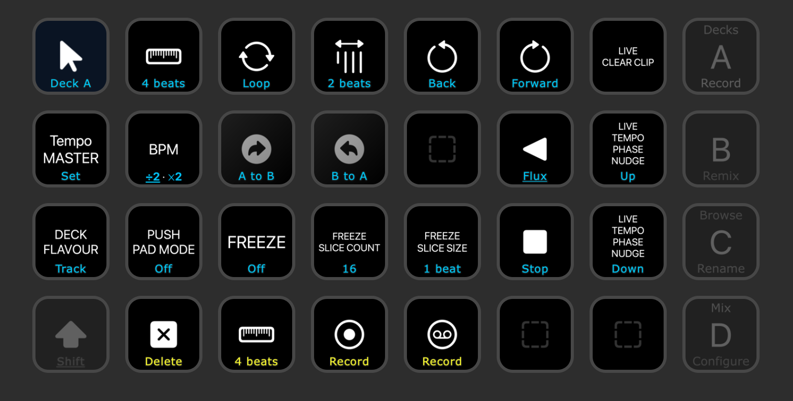
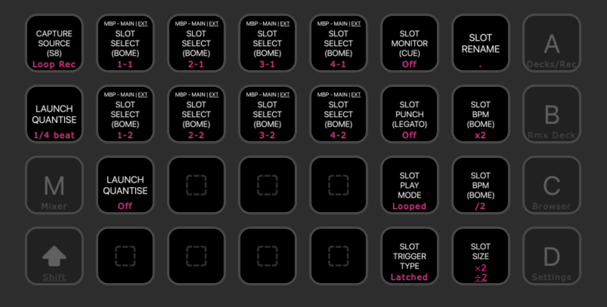
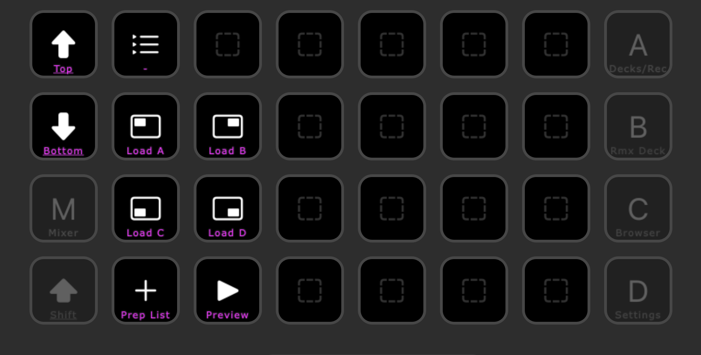
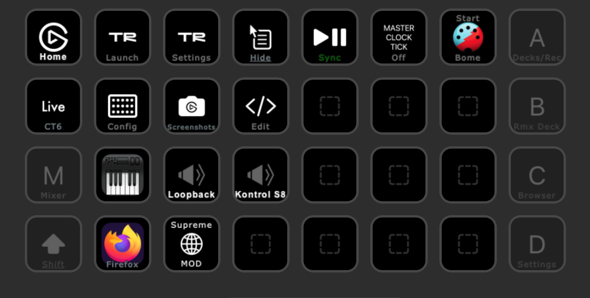

# Control Traktor

A collection of settings and Max4Live devices for improved control over Traktor Pro.

## Installation only

1. See [INSTALL](https://github.com/dotherightthing/control-traktor/blob/main/INSTALL.md)

## Installation and development

1. [Install Node and NPM](https://docs.npmjs.com/downloading-and-installing-node-js-and-npm) and [Git](https://git-scm.com/book/en/v2/Getting-Started-Installing-Git)
2. `git clone` this repo
3. Run `npm install` to install dependencies, run the build which outputs to `release`
4. Run `npm run backup` to overwrite local files with deployed files
5. Run `npm run watch` to build and update the release folder as you save file changes
6. Run `npm run release:install` to generate the release folder and copy the contents to system folders
7. Run `npm run release:share` to generate the release folder and copy it to `/Users/Shared/control-traktor/release` for sharing with other users on the same machine

### Supporting several macOS users

I run two user accounts on my MacBook Pro - a developer user and a creative user.

When fast-switching between these users, [NIHardwareAgent doesn't activate the S8's screens when it was already started by another user on the same machine](https://github.com/dotherightthing/control-traktor/issues/69).

To resolve this, use *automator/Launch Traktor.app* to launch Traktor Pro.

## Release

1. Update the `version` in package.json
2. Tag the latest commit with the message `Bump version`
3. Push to Github and an action will run to generate a new *Release*
4. Open [the Releases page](https://github.com/dotherightthing/control-traktor/releases) > select the release > Edit > Select Previous tag > Generate release notes

## Release notes

See <https://github.com/dotherightthing/control-traktor/releases>.

## Screenshots

Screenshots are of the Stream Deck XL templates.

Mappings are documented in [Traktor (CT6).streamDeckProfile.mappings.csv](./src/streamdeck-xl/profiles/Traktor%20(CT6)%2EstreamDeckProfile.mappings.csv).

---

## Thanks to

* [Ableton Max For Live Beginner's Masterclass (Phelan Kane / CM)](https://www.youtube.com/watch?v=tkXz8sf-KwU&t=751s)
* [Learning The Live Object Model and Creating 0dB Max (Josh Spoon / The Producer's Kitchen)](https://www.youtube.com/watch?v=agtnMQkDjUE)
* [Traversing the Ableton Live Object Model (Jeff Merkel)](https://www.youtube.com/watch?v=qeabaagMZr8)
* [JavaScript Live API Tutorials (Adam Murray / Compusition)](http://compusition.com/writings/js-live-api)
* [LOM - The Live Object Model (Cycling 74)](https://docs.cycling74.com/max8/vignettes/live_object_model)
* [Max JS Require Guide (Cycling 74)](https://docs.cycling74.com/max8/vignettes/jsrequire)
* [Paste pre-formed Max patches from Max's library](https://youtu.be/GvBAKJcK_S0?t=48)
* [Map UI objects to control surfaces incl Push2 (Phelan Kane)](https://youtu.be/tkXz8sf-KwU?t=3478)
* [Using prototypes to change the appearance of UI objects (Cycling 74)](https://youtu.be/yLhsm64lHS8?t=190)
* [Long Name is for Automation, Short Name is for UI (Cycling 74)](https://youtu.be/jfA61vLImNI?t=48)
* [The Max js object uses version 1.8.5 of the JavaScript language, a Mozilla specific superset of ECMAScript 5 (Cycling 74)](https://docs.cycling74.com/max8/tutorials/javascriptchapter01)
* [Places to Learn Max (Cycling 74)](https://cycling74.com/places-to-learn-max) > Books > [Max for Live Ultimate Zen Guide](https://leanpub.com/Max-for-Live-Ultimate-Zen-Guide)
* [How to map Encoders in Traktor](https://www.youtube.com/watch?v=BJZ27iVoq2A)
* [Midi Filter Select 1.4](https://www.maxforlive.com/library/device/4365/midi-filter-select) for the [gswitch](https://docs.cycling74.com/max8/refpages/gswitch?q=gswitch) tip

Tip: Search a YouTube video for 'Push': *Click 3 dots > Show transcript > Search in video*
